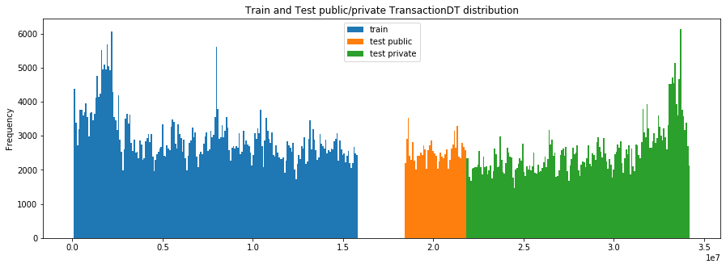
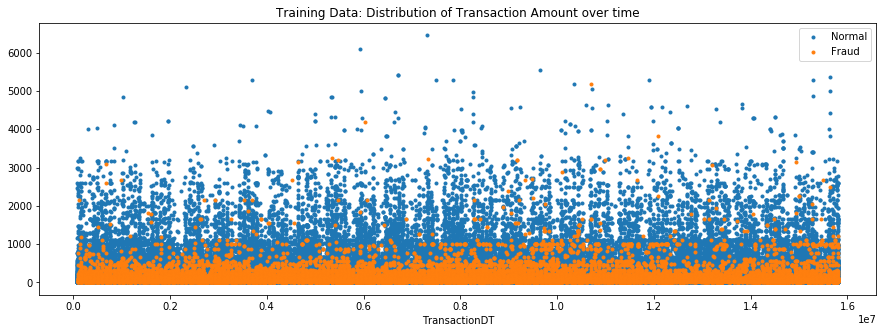

# IEEE-CIS Fraud Detection Kaggle Competition

## Overview

For my first Kaggle competition, I developed a model for detecting fraudulent credit/debit card transactions. Teams were asked to submit probability predictions on a provided test set and the winning team was decided based on which team had the submission with the highest ROC-AUC score. I, as a solo competitor, placed 1598 out of 6381 teams with a ROC-AUC score of 0.924103. I accomplished this by creating an ensemble of lightGBM models.

## Data

The training data is provided in two csv files, 'train_identity' and 'train_transaction'. The following is copied straight out of the description of the variables from the competition organizers:

###Transaction Table
1. TransactionDT: timedelta from a given reference datetime (not an actual timestamp)
2. TransactionAMT: transaction payment amount in USD
3. ProductCD: product code, the product for each transaction
4. card1 - card6: payment card information, such as card type, card category, issue bank, country, etc.
5. addr: address
6. dist: distance
7. P_ and (R__) emaildomain: purchaser and recipient email domain
8. C1-C14: counting, such as how many addresses are found to be associated with the payment card, etc. The actual meaning is masked.
9. D1-D15: timedelta, such as days between previous transaction, etc.
10. M1-M9: match, such as names on card and address, etc.
11. Vxxx: Vesta engineered rich features, including ranking, counting, and other entity relations.

Categorical Features:
1. ProductCD
2. card1 - card6
3. addr1, addr2
4. Pemaildomain Remaildomain
5. M1 - M9

### Identity Table
Variables in this table are identity information – network connection information (IP, ISP, Proxy, etc) and digital signature (UA/browser/os/version, etc) associated with transactions.
They're collected by Vesta’s fraud protection system and digital security partners.
(The field names are masked and pairwise dictionary will not be provided for privacy protection and contract agreement)

Categorical Features:
1. DeviceType
2. DeviceInfo
3. id12 - id38

### EDA Summary

Not a lot of data is provided about how the data was generated. User IDs are not provided to preserve anonymity, but . The training data and the submission data take place over approximately a year of transactions with a month missing in between the training and submission. The following plot highlights the distribution of transactions from the training data and the test data where the public and private portion of the leaderboard starts.

No dates are given, just time measured in seconds. It's possible to infer the dates and a lot of Kagglers believe that the spike in transactions towards the beginning implies that the first month is December and that the spike is

Based on the following table, we can quickly see that there is an imbalance between the number of fraudulent versus legitimate transactions.

|            | Count  | Percent |
|------------|--------|---------|
| Fraud      | 569877 | 96.5    |
| Legitimate | 20663  | 3.5     |

One of the most important features for determing fraudulent transactions is the transaction amount. The following plot shows Transaction Amount over time. 

## References

1. The following EDA notebook was used as a reference for a lot of my decision making: 

https://www.kaggle.com/alijs1/ieee-transaction-columns-reference

The creator of this notebook goes by the username 'alijs' on Kaggle. His profile can be found here. https://www.kaggle.com/alijs1

2. The following web scraper was used and written by 'Tony321' with kaggle profile https://www.kaggle.com/tony321

https://www.kaggle.com/tony321/almost-all-devices-info-usage-with-web-scraping?select=model_and_specs_info.joblib